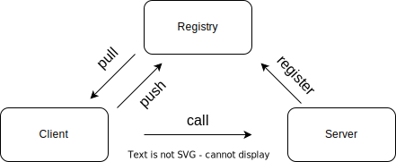

# TinyRpc

TinyRpc 是一款轻量级，模块化的 RPC 框架


## 架构




## 特点

- 面向接口编程
- 支持自动服务注册和发现
- 支持与 Spring 框架无缝整合
- 可以配置不同的序列化协议、负载均衡策略和注册中心
- 高可扩展


## 案例

**方式一：手动编程**

```java
public class Server {
    private static final Logger logger = LoggerFactory.getLogger(Server.class);

    public static void main(String[] args) throws Exception {
        String host = "127.0.0.1";
        int port = 2181;
        URI nameServiceUri = URI.create("zookeeper://" + host + ":" + port);

        logger.info("创建TinyRpc服务端实例...");
        TinyRpcServer server = new TinyRpcServer(8090, nameServiceUri);

        logger.info("创建服务提供者...");
        HelloService helloService = new HelloServiceImpl();

        logger.info("向RPC框架注册服务提供者...");
        server.addServiceProvider(helloService, HelloService.class);

        logger.info("开始提供服务...");
        server.start();
    }

}
```

```java
public class Client {
    private static final Logger logger = LoggerFactory.getLogger(Client.class);

    public static void main(String[] args) {
        String host = "127.0.0.1";
        int port = 2181;
        URI nameServiceUri = URI.create("zookeeper://" + host + ":" + port);

        logger.info("创建TinyRpc客户端实例...");
        TinyRpcClient client = new TinyRpcClient(nameServiceUri);

        logger.info("创建服务桩...");
        HelloService helloService = client.getRemoteService(HelloService.class);
        assert helloService != null;

        String name = "World!";
        logger.info("请求服务, name: {}...", name);
        String response = helloService.hello(name);
        logger.info("收到响应: {}.", response);
    }

}
```

**方式二：与 Spring 整合**

```java
public class Server {

    private static final Logger logger = LoggerFactory.getLogger(Server.class);

    public static void main(String[] args) {
        ApplicationContext applicationContext = new ClassPathXmlApplicationContext("spring-server.xml");
    }

}
```

```java
public class Client {

    public static void main(String[] args) {
        ApplicationContext applicationContext = new ClassPathXmlApplicationContext("spring-client.xml");
        HelloController controller = applicationContext.getBean(HelloController.class);
        controller.say();
    }

}
```

```java
@Component
public class HelloController {

    private static final Logger logger = LoggerFactory.getLogger(Client.class);

    @RpcReference
    private HelloService helloService;

    public void say() {
        String name = "World!";
        logger.info("请求服务, name: {}...", name);
        String response = helloService.hello(name);
        logger.info("收到响应: {}.", response);
    }

}
```


## 参考资料

- **[NettyRpc](https://github.com/luxiaoxun/NettyRpc)**
- **[simple-rpc-framework](https://github.com/liyue2008/simple-rpc-framework)**
